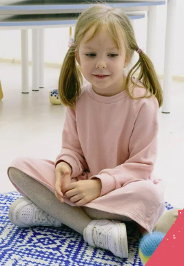

# Friendship Corner Daycare Website

A modern, responsive website for Friendship Corner Daycare built with **Next.js 16**, **React 19**, **TypeScript**, and **TailwindCSS v4**. This website replaces the existing site with enhanced visual aesthetics, animations, and improved user experience.

## 🖼️ Visual Showcase

<div align="center">
  
  
</div>

## 🌟 Features

### ✅ Implemented Features

- **🎨 Multi-Theme Support**: 5 beautiful themes (Professional, Nature, Playful, Dark, Violet)
- **✨ Advanced Animations**: GSAP ScrollTrigger & Framer Motion for premium feel
- **🎥 Dynamic Hero**: Immersive video backgrounds with fallback support
- **🍱 Modern Layouts**: Bento Grid & Montessori Card designs for information display
- **🌍 Internationalization**: Full content switching for English, Spanish, French, Korean, and Chinese with localized metadata and fallbacks
- **🔍 SEO & GEO**: Per-page metadata, server-rendered structured data (LocalBusiness, FAQPage, Course), XML sitemap, robots.txt that welcomes AI crawlers, and `llms.txt` / `llms-full.txt` for generative engines
- **📱 Responsive Design**: Optimized for all devices with Mobile QR Access
- **🖼️ Image Gallery**: Animated carousel with category filtering and lightbox view
- **🗺️ Google Maps Integration**: Interactive map showing daycare location
- **⚡ Performance**: Optimized with Next.js 16 server components and Turbopack

### 🏗️ Project Structure

```text
src/
├── app/                    # Next.js App Router
│   ├── page.tsx           # Homepage (single-page sections + contact/FAQ)
│   ├── programs/[slug]/   # Toddler / Preschool / Pre-Kindergarten pages
│   ├── community/         # Montessori, ECE, journal, today's story
│   ├── funding/           # Subsidies & tuition
│   ├── our-team/          # Educators
│   ├── resources/         # Parent handbook & forms
│   ├── gallery-new/       # Photo & video gallery
│   ├── sitemap.xml/       # XML sitemap route
│   ├── robots.ts          # robots.txt (incl. AI crawlers)
│   └── globals.css        # Global styles & theme system
├── components/
│   ├── layout/            # Header, Footer, Navigation
│   ├── sections/          # Page sections
│   └── ui/                # Reusable UI components
├── contexts/              # React contexts (Theme, Language)
├── data/                  # Programs, FAQ, staff, reviews content
├── i18n/                  # Internationalization config
├── lib/                   # SEO, business profile, integrations
└── messages/              # Translation files
```

## 🚀 Getting Started

### Prerequisites

- Node.js 18+
- npm or yarn

### Installation

1. **Clone the repository**

```bash
git clone <repository-url>
cd friendshipdaycare
```

1. **Install dependencies**

```bash
npm install
```

1. **Start development server**

```bash
npm run dev
```

1. **Open in browser**
    Navigate to [http://localhost:3000](http://localhost:3000)

## 📋 Content Migration

The website content has been migrated and enhanced from the original site:

### School Information

- **Name**: Friendship Corner Daycare (Montessori)
- **Type**: Licensed Group Daycare (Non-profit society)
- **Established**: January 2008
- **Location**: Near Coquitlam Station, Coquitlam, BC
- **Address**: 2950 Dewdney Trunk Road, Coquitlam, BC V3C 2J4, Canada
- **Phone**: 604.945.8504
- **Email**: <friendship.care@live.ca>
- **Age Range**: 30 months to school age
- **Service Area**: Tri-Cities (Coquitlam, Port Coquitlam, Port Moody)

### Enhanced Content Features

- **Inspiring Hero**: "Where Young Minds Flourish"
- **Detailed Programs**: Toddler, Preschool, Pre-Kindergarten
- **Educational Focus**: Montessori method + gentle Bible stories
- **Safety & Quality**: Licensed, qualified staff, individual attention

## 🎨 Theme System

The website supports 5 themes:

1. **Professional** - Clean & Corporate
2. **Nature** - Earth tones and greens
3. **Playful** - Bright and vibrant colors
4. **Dark** - Elegant dark theme
5. **Violet** - Soft purple aesthetics

Themes are stored in localStorage and applied system-wide.

## 🌍 Multi-Language Support

Supported languages:

- 🇺🇸 English
- 🇪🇸 Spanish  
- 🇫🇷 French
- 🇰🇷 Korean
- 🇨🇳 Chinese

Translation files are located in `src/messages/`.

## 🗺️ Google Maps Setup

To enable the interactive map on the contact page:

1. Get a Google Maps API key from [Google Cloud Console](https://console.cloud.google.com/)
2. Enable the Maps Embed API
3. Update the API key in `src/components/ui/GoogleMap.tsx`

See `GOOGLE_MAPS_SETUP.md` for detailed instructions.

## 📸 Gallery Setup

The gallery supports both photos and videos. Images are stored in **Cloudflare R2** (not locally).

**To add content:**

1. **Photos**: Upload images to R2 `images/` folder via Cloudflare dashboard
2. **Update** image arrays in gallery components using `/images/` paths
3. **Videos**: Update video URLs in the VideoPlayer components
4. **Access**: Use `getImageUrl('/images/filename.jpg')` helper function

See `docs/images-readme.md` and `docs/images-videos-usage-analysis.md` for details.

## 🛠️ Technology Stack

- **Framework**: Next.js 16 with App Router
- **Language**: TypeScript
- **Styling**: TailwindCSS v4
- **Animations**: GSAP (GreenSock) + Framer Motion
- **UI Components**: Aceternity UI, Magic UI, Lucide Icons
- **Video**: React Player
- **Carousel**: Embla Carousel
- **Forms**: React Hook Form with Zod validation
- **Internationalization**: next-intl

## 📱 Pages Overview

### Homepage (`/`)

- Hero section with compelling tagline
- About section with mission
- Programs overview
- Daily video showcase
- Contact information

### About (`/about`)

- Detailed daycare information
- History and mission
- Staff qualifications
- Montessori approach

### Programs (`/programs`)  

- Age-specific program details
- Toddler Program (30 months - 3 years)
- Preschool Program (3 - 4 years)
- Pre-Kindergarten (4 - 5 years)

### Gallery (`/gallery`)

- Photo gallery with categories
- Animated carousel
- Educational videos
- Activity highlights

### Contact (`/contact`)

- Contact form
- Location information
- Interactive Google Map
- Operating hours

## 🔧 Build & Deployment

### Development

```bash
npm run dev      # Start dev server
npm run build    # Build for production  
npm run start    # Start production server
npm run lint     # Run ESLint
```

### Production Deployment

The site is optimized for deployment on:

- Vercel (recommended for Next.js)
- Netlify
- Any Node.js hosting provider

## 📞 Support & Contact

For questions about this website implementation:

- Review the documentation files
- Check the component source code
- Refer to Next.js and TailwindCSS documentation

For daycare enrollment and information:

- **Phone**: 604.945.8504
- **Email**: <friendship.care@live.ca>
- **Address**: 2950 Dewdney Trunk Road, Coquitlam, BC V3C 2J4, Canada

### Developer Credit

Website design and development by **Best IT Consulting** (<www.bestitconsulting.ca>).

---

**Built with ❤️ for Friendship Corner Daycare - Where Young Minds Flourish**
