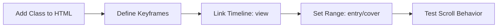

## **CSS Scroll Animation Definitions**

### **1. Auto-Rotating Element**
Ideal for decorative icons or background shapes that spin as you scroll.

```css
.auto-rotated {
  animation: rotate-animation linear;
  animation-timeline: view();
}

@keyframes rotate-animation {
  from { transform: rotate(0deg); }
  to { transform: rotate(360deg); }
}
```

### **2. Fade-In and Slide-Up (Auto Show)**
A classic landing page effect where text or cards slide into view.

```css
.autoshow {
  animation: text-appear linear both;
  animation-timeline: view();
  animation-range: entry 20% cover 40%;
}

@keyframes text-appear {
  from {
    opacity: 0;
    transform: translateY(100px);
  }
  to {
    opacity: 1;
    transform: translateY(0);
  }
}
```

### **3. Staggered Timeline Animation**
Use these variations to make items in a list appear one after another as you scroll down.

```css
/* Apply .fade-up to all items, then unique ranges for staggering */
.fade-up {
  animation: fade-up-logic linear both;
  animation-timeline: view();
}

.item-1 { animation-range: entry 20% cover 40%; }
.item-2 { animation-range: entry 40% cover 60%; }
.item-3 { animation-range: entry 60% cover 80%; }

@keyframes fade-up-logic {
  from {
    opacity: 0;
    transform: translateY(50px) scale(0.5);
  }
  to {
    opacity: 1;
    transform: translateY(0) scale(1);
  }
}
```

### **4. Blur & Focus (Auto Blur)**
Creates a "spotlight" effect where text is only clear when it is in the center of the screen.

```css
.autoblur {
  animation: blur-logic linear both;
  animation-timeline: view();
}

@keyframes blur-logic {
  0% { filter: blur(20px); }
  35%, 45% { filter: blur(0px); } /* Sharp in the middle */
  70% { filter: blur(20px); }
  100% { filter: blur(0px); }
}
```

### **5. Horizontal Scroll Container**
This defines the behavior of the parent container for a "snap-to-item" horizontal gallery.

```css
.horizontal-scroll-wrapper {
  display: flex;
  overflow-x: auto;
  scroll-snap-type: x mandatory;
  scroll-behavior: smooth;
  /* Custom Scrollbar */
  scrollbar-width: thin;
  scrollbar-color: #00ff00 #333; 
}

.horizontal-scroll-wrapper > div {
  scroll-snap-align: center;
  flex-shrink: 0;
}
```

---

### **Implementation Workflow**




### Aceternity UI (or inspired):

- CardSpotlight (src/components/ui/card-spotlight.tsx)
- AuroraBackground (src/components/ui/aurora-background.tsx)
- BentoGrid and BentoGridItem (src/components/ui/bento-grid.tsx)
- WobbleCard (src/components/ui/wobble-card.tsx)
- HeroFlipDescription (src/components/ui/hero-flip-description.tsx)


### Magic UI (or inspired):

- Utilities and animation patterns in src/lib/magicui-animations.ts:
`textReveal, textRevealItem, shimmer, borderBeam, gridPattern, spotlight, ripple, flip, gradientBorder, pulseGlow, staggerContainerMagic, scaleInMagic, etc.`
- CSS keyframes and utility classes in globals.css (e.g., shimmer, gridMove, magic-float, pulse-soft, magic-shimmer, magic-grid)
- Used in components like ContactFormSection, EnrollmentSectionContent, and page-client.tsx (e.g., staggerContainerMagic, gridPattern)

### 🎨 Friendship Corner Daycare — Background BlueHere's a full breakdown:

| Format | Value |
|---|---|
| **HEX** | `#679ECB` |
| **RGB** | `rgb(103, 158, 203)` |
| **HSL** | `hsl(206, 49%, 60%)` |
| **OKLCH** (Tailwind v4) | `oklch(64% 0.09 220)` |

It's a **soft cornflower/steel blue** — warm enough to feel friendly and child-oriented, light enough to keep the logo approachable. For your Tailwind v4 project, add it to your CSS as:

```css
:root {
  --color-brand: oklch(64% 0.09 220); /* Friendship Corner blue */
}
```