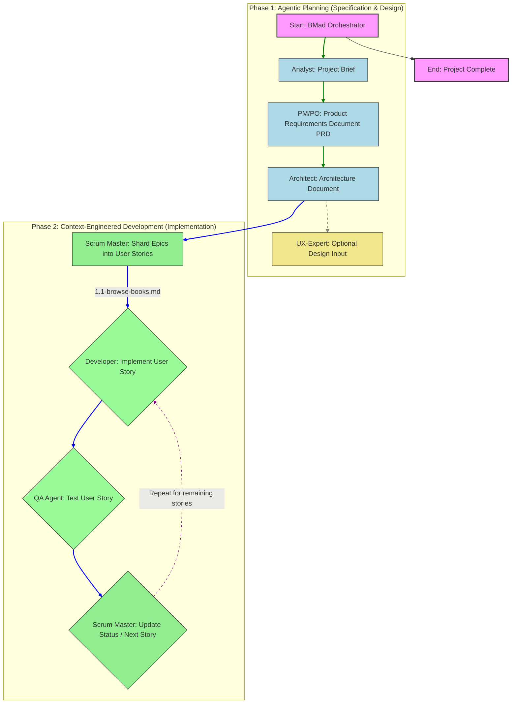

## 🥝 Superpowers

- brainstorming - Socratic design refinement
- writing-plans - Detailed implementation plans
- executing-plans - Batch execution with checkpoints
- dispatching-parallel-agents - Concurrent subagent workflows
- requesting-code-review - Pre-review checklist
- receiving-code-review - Responding to feedback
- using-git-worktrees - Parallel development branches
- finishing-a-development-branch - Merge/PR decision workflow
- subagent-driven-development - Fast iteration with two-stage review (spec compliance, then code quality)


## 🥃 Spec-Kit

## 🥃 BMAD-METHOD

- "Breakthrough Method for Agentic Development” or “Breakthrough Method for Agile AI-Driven Development.”
- Agentic (代理的; 代理的，像代理人的；（心理学）代理人的，服从权威的；（心理学）与表现或地位有关的；（心理学）主体的) Planning
- Context-Engineered Development
- BMAD vs. Spec Kit vs. Open Spec

### 🍅 Agents

- analyst
- architect
- bmad-master
- bmad-orchestrator
- dev
- pm
- po
- qa
- sm
- ux-expert




```text
Analyst → PM → Architect → Developer → QA
  (brief)  (PRD) (arch doc)  (stories)  (tests)
              ↕
         Tech Writer (docs throughout)
         UX Designer (before dev)
```


## 🍅 OpenSpec


## 🥃 

## 🍆 ollama

```shell
$ ollama list
glm-4.7-flash:latest    19 GB
qwen3.5:latest     6.6 GB        
jingyaogong/minimind2:latest  208 MB         
nomic-embed-text:latest  274 MB  

$ ollama launch codex --model glm-4.7-flash
$ ollama launch openclaw --model glm-4.7-flash
```

## 🥑 claude

```
b77
ollama launch claude --model glm-4.7-flash
/init
```

## 🥃 codex

## 🥝 opencode

opencode/big-pickle: based on GLM-4.6


## 🍅 OpenClaw

## 🍆

## 🥑

## 🍆

## 🥝


## 🍅


## 🍆

## 🥑
