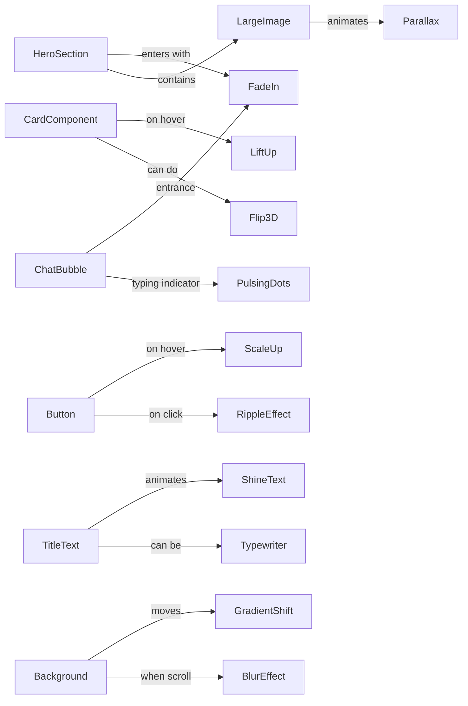
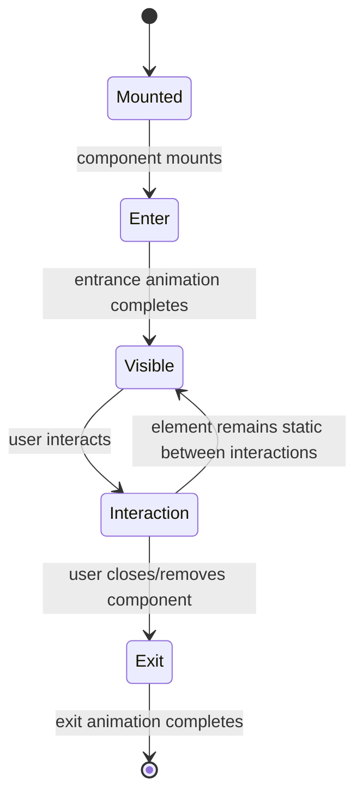

# Frontend UI Animation Reference

**Executive Summary:** This reference guide surveys leading animation libraries and techniques for React/TypeScript frontends. We cover libraries (shadcn/ui, GSAP, Magic UI, Aceternity UI, 21st.dev, Framer Motion), their pros/cons, and how to integrate them. We also catalog animation patterns (hero sections, cards, backgrounds, text, chat UI, scroll-triggered effects) with CSS and JS recipes, and outline design guidelines for typography, color, motion choreography, accessibility (reduced motion), and performance testing. Best practices—like using well-timed easings, staggered reveals, CSS variables, and media queries for motion preferences—are emphasized. Diagrams illustrate how components map to animations and the lifecycle of animations (mount, enter, interact, exit). A comparison table of libraries’ attributes (learning curve, bundle size, SSR, etc.) is included. Finally, a production checklist and utility snippets (keyframes, easing tokens, CSS vars) summarize what’s needed to ship polished animated UIs.

## Key Resources

- **shadcn/ui (Docs & GitHub)** – An open-source collection of React components built on Tailwind/Radix【1†L132-L139】. (See [shadcn/ui Introduction](https://ui.shadcn.com/docs) for design goals.)  
- **GSAP (GreenSock Docs)** – The official docs describe “blazingly fast, responsive animations for all browsers” with a core + plugins model【5†L152-L158】. (Includes Timeline, Tween, ScrollTrigger, etc.)  
- **Magic UI (Website & GitHub)** – Open-source library of 150+ animated React components (Tailwind + Framer Motion) for landing pages【15†L25-L30】【47†L227-L234】.  
- **Aceternity UI (Website)** – Copy-paste repository of 200+ Tailwind/Framer-Motion components and templates for modern marketing pages【22†L20-L24】. (Freely available with source code.)  
- **21st.dev (Platform)** – A dev platform/registry of React UI components (including 426 animated ones) styled with Tailwind for Next.js【27†L52-L56】. (AI-driven agent tools with UI library.)  
- **Framer Motion (motion.dev)** – Production-ready React animation library (“Motion for React”) for smooth UI animations【39†L158-L166】【39†L192-L201】. (Formerly Framer Motion, with plugins like AnimatePresence, gestures, layout.)  
- **Anthropics Frontend Skills (GitHub)** – Design guidelines for “production-grade frontend interfaces” emphasizing typography, color, motion, composition and details【35†L304-L313】【35†L317-L323】. (Influences patterns below.)  
- **MDN & Accessibility** – Browser docs on CSS keyframes, easing, and `prefers-reduced-motion` for animation (e.g. MDN CSS Animation and `@media (prefers-reduced-motion: reduce)` guides【43†L215-L223】).  

## Libraries & Tools

### shadcn/ui  
**Overview:** shadcn/ui is a Tailwind/Radix-based React *component library builder*. Rather than a closed library, it provides *open-sourced* UI components and templates as code you install via CLI【1†L132-L139】. This means **all component code lives in your repo** (AI-friendly, fully customizable).  
- **Strengths:** Highly customizable (styles are all in your code). Beautiful default designs, accessible (Radix) components. AI/LLM integration friendly (open code)【1†L132-L139】. Encourages composition of primitives. No proprietary styling system (just Tailwind CSS).  
- **Weaknesses:** Initial setup (CLI + Tailwind) can be more work. Not a drop-in animation library by itself (animations must be added manually). Component set grows but less out-of-box variety than generic UI kits. Requires React environment.  
- **Use Cases:** Building custom design systems or apps with unique styling, migrating from other UI kits (MUI/Chakra). Ideal if you want full control (themes via CSS variables, etc.).  
- **Integration:** Install via npm/CLI, then import components. Example:  
  ```tsx
  import { Button } from "@/components/ui/button";
  function App() {
    return <Button className="px-4 py-2">Click me</Button>;
  }
  ```  
  (shadcn/ui components use Radix under the hood, so they include proper `aria` roles by default.)  
- **Performance:** Minimal bundle impact since styles are just Tailwind classes and headless JS. No runtime CSS, so small footprint. All styling is static and CSS-only unless you add JS.  
- **Accessibility:** High out-of-box (Radix components cover WAI-ARIA). You must still handle animations: prefer CSS transitions (e.g. use `motion` or `animate-presence` manually). For reduced motion, follow WCAG (see Accessibility section).  
- **Migration:** To go from e.g. Material-UI, compare component features. Learning curve is moderate (familiarity with Tailwind and composition required). Can incrementally replace parts of UI.  

### GSAP (GreenSock Animation Platform)  
**Overview:** GSAP is a mature, imperative JS animation library (“blazing fast, responsive animations”)【5†L152-L158】. It provides tweens, timelines, and plugins (ScrollTrigger, Draggable, etc.). Core is small (~30KB minified/gzipped) and others load on demand. The **Timeline** feature allows complex sequencing. Works in any JS environment (React, vanilla, etc.).  
- **Strengths:** Extremely powerful and performant. Can animate *any* numeric property (CSS, SVG, canvas, object values, etc.) with smoothing and physics. Rich plugin ecosystem (ScrollTrigger, Flip, MorphSVG, etc.). Features like repeat, yoyo, keyframe arrays【5†L447-L456】. Runs high-FPS (<60fps) by default (with lag smoothing).  
- **Weaknesses:** API is imperative (not React-declarative), so it can feel heavy in React. It’s global/js-driven (you manage refs and effects). Bundle size with many plugins can grow. Licensing: core is free (MIT), but some plugins require a paid license. Learning curve is steep if you need complex controls.  
- **Use Cases:** Advanced effects (timeline sequences, parallax scroll, SVG draw, physics, scrubbing, complex easing). Games, interactive features, banner animations, any scenario where CSS is insufficient. e.g. use ScrollTrigger for on-scroll reveals or horizontal scroll effects.  
- **Integration Notes:** In React, typically import gsap in a component and trigger in `useEffect`. Example:  
  ```tsx
  import { useRef, useEffect } from "react";
  import { gsap } from "gsap";
  function FadeInSection() {
    const el = useRef<HTMLDivElement>(null);
    useEffect(() => {
      if (el.current) {
        gsap.fromTo(el.current, { y: 20, opacity: 0 }, { y: 0, opacity: 1, duration: 1 });
      }
    }, []);
    return <div ref={el}>Hello</div>;
  }
  ```  
  To animate on scroll, register ScrollTrigger:  
  ```js
  gsap.registerPlugin(ScrollTrigger);
  gsap.to(el.current, {
    scrollTrigger: { trigger: el.current, start: "top 80%" },
    opacity: 1, y: 0, duration: 1
  });
  ```  
- **Accessibility:** No built-in reduced-motion support, but you can check `window.matchMedia('(prefers-reduced-motion)')` or use `gsap.matchMedia()`【5†L195-L198】 to disable/simplify animations. Always test with motion disabled (set no critical info in animation).  
- **Performance:** Very performant. `gsap.to()` updates styles via `requestAnimationFrame`. Use transforms (not layout-affecting CSS) where possible. Staggered animations and timelines can be GPU-accelerated (e.g. use `transform: translateZ(0)`).  
- **Migration Tips:** To move from CSS to GSAP, note that CSS is declarative while GSAP controls states. From anime.js or Velocity, GSAP has similar API. GSAP 3 is <23KB gzipped【7†L13-L14】, smaller than GSAP2. If code-splitting, load GSAP from CDN if needed. Use `useEffect` or GreenSock’s React utilities (e.g. `gsap.context()` or the unofficial `use-gsap` hook) for easier integration.  

### Magic UI  
**Overview:** Magic UI is a free, open-source *collection* of React/Tailwind components with built-in animations. It advertises “150+ animated components and effects”【15†L25-L30】 for landing pages. It’s essentially a components library (with a docs site) where you copy-paste code snippets (no NPM package). Built by Dillion, it relies on Tailwind CSS and Framer Motion under the hood.  
- **Strengths:** Huge variety of ready-made animated UI blocks (hero banners, cards, text effects, buttons, backgrounds, etc.)【15†L25-L30】【47†L227-L234】. Low effort to use: simply copy the component’s code or install via their CLI. Ideal for quickly prototyping slick landing pages or marketing sites. Supports themes (light/dark) and is Shadcn-compatible.  
- **Weaknesses:** Not a dynamic library – you use it by copying code or adding their dependencies. Customization beyond provided props may require tweaking their code. Bundle size can grow if many components (each uses Framer Motion, React). Because it’s Tailwind+Motion, basic styles require those frameworks. Some animations are more “tweak-and-trust” (less granular control).  
- **Use Cases:** Startup landing pages, promotional sites, marketing content. Anything needing “designy” interactions (glitches, 3D effects, fancy text, etc.) without building from scratch. Companies like those in their showcase use it to accelerate UI: *“build beautiful landing pages in minutes”*【15†L25-L30】.  
- **Integration Notes:** Install Magic UI via npm (packaged as `@magic-ui/cli` or copy code?). Then import components or copy JSX. E.g.:  
  ```tsx
  import { Marquee } from "magic-ui";
  function MyHero() {
    return <Marquee text="Welcome to our site!" />;
  }
  ```  
  (Exact import depends on your setup; their docs show examples for various blocks.) Templates are available (free & Pro).  
- **Code Example (React/TS):** Magic UI components often accept props to control animation. For instance:  
  ```tsx
  import { MotionDiv } from "magic-ui"; 
  // MotionDiv could be a Magic UI component with built-in scroll animations
  function Demo() {
    return <MotionDiv className="p-4 bg-blue-500">Animated Block</MotionDiv>;
  }
  ```  
  *Note:* Actual import names vary; refer to their [documentation](https://magicui.design/docs) for specific components.  
- **Accessibility/Performance:** Magic UI itself doesn’t specifically include accessibility toggles. It’s the user’s job to handle ARIA, reduced-motion wrappers, etc. Components are static React code, so SSR works (next.js projects supported). Performance depends on how many components you use; each often includes Framer Motion animations and Tailwind classes, so bundle size grows with usage. Code-splitting templates/pages helps.  
- **Migration:** If you already use Framer Motion + Tailwind, migrating to Magic UI is trivial (just copy blocks). If coming from pure CSS designs, expect to integrate Tailwind. Magic UI is a drop-in suite of examples – you don’t “migrate” to it beyond adopting its code patterns.  

### Aceternity UI  
**Overview:** Aceternity UI is another free collection of Tailwind + Framer Motion components (200+ items) for React/Next.js【22†L20-L24】. It positions itself as “shadcn/ui for magic effects” (per tweets) and aims to accelerate UI by copy-pasting pre-built interactive sections (hero, cards, backgrounds, etc.). Components come with animations already wired.  
- **Strengths:** Very large catalog (hero sections, grids, interactive backgrounds, card effects, text animations, etc.)【20†L157-L165】【22†L20-L24】. Emphasis on “production-ready” – professionally designed. Open-source (GitHub) so you see all code.  
- **Weaknesses:** Like Magic UI, it’s code-first rather than a runtime library. You incorporate components individually (no lazy load – each uses Framer Motion under the hood). Not a framework itself, so no global theming beyond what code offers. Learning curve is minimal (copy-paste), but customizing animations requires digging into code.  
- **Use Cases:** Rapidly building marketing pages or dashboards that need more flair. Aceternity also bundles templates (free vs. paid all-access). Many components use advanced effects (e.g. 3D card tilt, text reveal, vortex backgrounds). If you need complex micro-interactions without writing GSAP, this is a time-saver.  
- **Integration:** Components are exported as React/TSX. For example, after installing `npm install ui.aceternity.com` (if a package) or copying a code block, you might:  
  ```tsx
  import { GlareCard } from "aceternity-ui";
  function MyCards() {
    return (
      <GlareCard image="/photo.jpg" title="Hello" description="..." />
    );
  }
  ```  
  Components expose props for customization (e.g. `blur`, `colors`, `speed`).  
- **Code Example:** Many Aceternity components are essentially wrappers around Framer Motion. For instance, an expandable card:  
  ```tsx
  import { ExpandableCard } from "aceternity-ui";
  <ExpandableCard title="More Info" content="Hidden content" />;
  ```  
  Under the hood, this might use `<motion.div initial={{ scale: 1 }} whileHover={{ scale: 1.05 }}>`.  
- **Accessibility/Performance:** Same caveats as Magic UI. It’s React+Motion, so SSR works. Components likely have appropriate ARIA roles for their UI (e.g. `<button>`) but read docs. Use media queries for reduced motion if needed. Each component’s code can be tweaked (e.g. wrap in `useReducedMotion`).  
- **Migration:** No “migration” needed – simply copy Aceternity code in. If moving away, you’d need to replace those components with your own, since it’s not a runtime dependency.  

### 21st.dev Animated Components  
**Overview:** 21st.dev is an AI-driven platform for building agentic UIs, but it also includes a large **component library**. Their *“Animated Components”* section boasts *426 animated React components* styled with Tailwind CSS【27†L52-L56】. These cover categories like heroes, features, CTAs, chat UIs, and many specialized widgets. It’s effectively a marketplace of code snippets you can search and filter.  
- **Strengths:** Massive variety of modern UI bits (including advanced scroll & WebGL effects). Components are peer-reviewed/curated with designer input. AI search can help you find relevant ones quickly. Each component is open-source, so you see exactly how animations work (often CSS + JavaScript).  
- **Weaknesses:** Not an NPM package or runtime. You typically copy component code into your project. Requires account access. Since it’s community-driven, quality varies (some might need polishing). Underlying code may use whatever libraries (Framer, vanilla JS, Three.js, etc.).  
- **Use Cases:** Great for AI-assisted prototyping or when you need a specific effect (e.g. animated AI chat UI, widgets like “Message Dock”, “Hero 1” etc.). Integrates well if your project already uses Tailwind/React.  
- **Integration:** Browse the 21st.dev catalog, filter (e.g. “Animated Components”), find a snippet, and embed. For example, an “AI Chat Input” component might render a typing animation or glowing border on focus. You simply paste the JSX/CSS into your React project.  
- **Example:** If they provide a component `AnimatedChatBubble`, you might use:  
  ```tsx
  import { AnimatedChatBubble } from "21st.dev"; // pseudo-code
  <AnimatedChatBubble from="User" message="Hello there!" />;
  ```  
  More likely, 21st.dev will give raw code rather than a published package; so you’d copy the given JSX and styles.  
- **Accessibility/Performance:** Each component is independent. Some may need adjustments for a11y (e.g. ARIA). Check performance – large components (WebGL backgrounds) can be heavy. Since it’s all client JS, SSR isn’t meaningful (you only use them in CSR context).  
- **Migration:** Components are meant to be one-off. To “migrate” away, replace with your own code or a different library.  

### Framer Motion (Motion)  
**Overview:** Motion (the rebranded Framer Motion) is a declarative React animation library【39†L158-L166】. It provides `<motion>` components and animation props (`initial`, `animate`, `whileHover`, `exit`, etc.) along with hooks. It leverages the Web Animations API for 120fps hardware-accelerated performance【39†L162-L169】 and automatically handles component mount/unmount animations via `AnimatePresence`. In short, it’s built *for React* and tightly integrated with state/props (unlike GSAP’s imperative style)【39†L192-L201】.  
- **Strengths:** Intuitive JSX API (animation props in markup). Supports gestures (hover/tap/drag) and scroll-aware animation (with `useScroll`). Variants allow coordinated parent-child animations. Framer Motion is fully tree-shakable and has TypeScript types. Tight React integration makes it easy to animate on state changes. It also handles exit animations (AnimatePresence). Performance is optimized (120fps, spring physics, hardware-accel)【39†L162-L169】.  
- **Weaknesses:** Slightly larger bundle (~20–25KB gzipped). You must wrap components with `<motion.*>` instead of plain HTML tags. On initial SSR hydration, animations may flash unless `initial={false}` is used. For very simple hover effects, CSS transitions are lighter. Although powerful, Motion may be overkill for trivial animations.  
- **Use Cases:** React apps needing smooth transitions and interactivity: modals, sliders, drag-and-drop lists, micro-interactions (button presses, menu animations), content reveals on scroll (via `useInView`). Especially valuable for page load animations or component animations tied to React state.  
- **Integration:** Install via `npm install motion`. Basic use:  
  ```tsx
  import { motion } from "motion/react";
  function Banner() {
    return (
      <motion.div
        initial={{ opacity: 0, y: 20 }}
        animate={{ opacity: 1, y: 0 }}
        transition={{ duration: 0.5 }}
      >
        Welcome!
      </motion.div>
    );
  }
  ```  
  This will fade/slide in the content. Gestures: `<motion.button whileHover={{ scale: 1.05 }} whileTap={{ scale: 0.95 }}>Click</motion.button>`.  
- **Accessibility:** Built-in hook `useReducedMotion()` allows easily disabling animations for users who prefer less motion. For example, wrap animations in `{shouldReduceMotion ? {} : { animate: {...} }}`. SSR is supported: you can avoid hydration mismatches by using `initial={false}` on first render or checking for `typeof window`. Framer’s docs include a full [Accessibility guide](https://motion.dev/docs/accessibility) for patterns.  
- **Performance:** Motion leverages native browser APIs when possible (Web Animations, CSS transitions). It performs well on modern devices, but test on low-end hardware if you have many concurrent animations. Use `transform` and `opacity` where possible (these animate cheaply). Avoid animating layout properties (width/height) frequently. Use `will-change` sparingly.  
- **Migration:** For those familiar with Framer Motion v5, note the new package name (`motion/react`) and some API changes (hooks, etc.). To migrate away, any Framer-based code would need rewriting into CSS/GSAP, etc. The API is higher-level than GSAP; conversely, if coming from GSAP, you’ll trade a global tween API for React props.

## Animation Patterns & Recipes

Below are common UI patterns with code snippets (CSS and JS/React) and tips. Use progressive enhancement: always ensure the UI is usable without animation (e.g. content still visible if JS/CSS fails), and consider a “prefers-reduced-motion” fallback (see Accessibility section).

### Hero Sections  
- **Effects:** Fade-in text/images, slide-up or slide-down on load, parallax background, typewriter text, video backgrounds. Use a dramatic introduction.  
- **CSS Example (fade/slide):** 
  ```css
  .hero {
    opacity: 0;
    transform: translateY(20px);
    transition: opacity 0.6s var(--ease-standard), transform 0.6s var(--ease-standard);
  }
  .hero.visible {
    opacity: 1;
    transform: translateY(0);
  }
  ```
  In JS or React you can add `.visible` class on mount (e.g. using an effect or intersection observer).  
- **React/Framer Example:** 
  ```tsx
  import { motion } from "motion/react";
  function Hero() {
    return (
      <motion.header
        initial={{ opacity: 0, y: 20 }}
        animate={{ opacity: 1, y: 0 }}
        transition={{ duration: 0.7 }}
        className="hero px-8 py-16 bg-gray-800"
      >
        <h1 className="text-5xl font-bold">Welcome to Our Site</h1>
      </motion.header>
    );
  }
  ```  
- **Parallax Background:** Apply `background-attachment: fixed` in CSS, or use JS libraries (e.g. GSAP ScrollTrigger or simple scroll handlers) to translate background images on scroll.  
- **Progressive Enhancement:** Ensure the hero content loads statically (without animation) if CSS/JS fails. For example, use a CSS class that applies the end state by default when JS disabled. Use `prefers-reduced-motion` to disable transitions if needed.

### Card Components  
- **Effects:** Hover lift/scale, shadow growth, 3D tilt, flip, reveal detail.  
- **CSS Hover Lift:** 
  ```css
  .card {
    transition: transform 0.3s var(--ease-out-quad), box-shadow 0.3s ease;
    box-shadow: 0 2px 4px rgba(0,0,0,0.1);
  }
  .card:hover {
    transform: translateY(-5px) scale(1.02);
    box-shadow: 0 10px 20px rgba(0,0,0,0.2);
  }
  ```  
- **CSS 3D Flip Card:** 
  ```css
  .card-flip { perspective: 800px; }
  .card-inner {
    transition: transform 0.6s;
    transform-style: preserve-3d;
  }
  .card-flip:hover .card-inner {
    transform: rotateY(180deg);
  }
  .card-front, .card-back {
    backface-visibility: hidden;
    position: absolute; top:0; left:0;
    width:100%; height:100%;
  }
  .card-back { transform: rotateY(180deg); }
  ```  
- **React/Framer Tilt (hover):** 
  ```tsx
  import { motion } from "motion/react";
  <motion.div 
    className="card"
    whileHover={{ scale: 1.03, y: -5 }}
  >
    
    <h2>Title</h2>
  </motion.div>
  ```  
- **Flip with Framer (AnimateSharedLayout):** 
  Use `<motion.div layout>` on front/back panels and toggle a state. Motion will animate between them.  
- **Progressive Enhancement:** Always have card content visible. The hover-effects should not move important info off-screen (only small lifts/zooms). Use `will-change: transform` if many on screen for smoother GPU acceleration.

### Background Gradients & Visuals  
- **Animated Gradients:** Keyframe animate `background-position` or `background-color`. Example CSS: 
  ```css
  @keyframes gradient-bg {
    0% { background-position: 0% 50%; }
    50% { background-position: 100% 50%; }
    100% { background-position: 0% 50%; }
  }
  .bg-animated {
    background: linear-gradient(270deg, #ff0047, #2c34c7, #00c2ff);
    background-size: 600% 600%;
    animation: gradient-bg 10s ease infinite;
  }
  ```  
- **Wave/Grid Patterns:** Use CSS repeating gradients or SVG backgrounds, animate via CSS transforms or JS (e.g. GSAP moving grid lines). For example, use multiple layered `<div>`s with dots/lines and animate opacity or position.  
- **Parallax/Bokeh:** Place layered images or SVGs and move them at different scroll speeds (ScrollTrigger or simple `window.scroll` listeners adjusting `transform: translateY()`).  
- **Framer Motion:** Animating background color or gradient variables: 
  ```tsx
  import { motion } from "motion/react";
  <motion.section
    className="w-full h-64"
    animate={{ backgroundColor: ["#ff0047", "#00c2ff"] }}
    transition={{ duration: 5, repeat: Infinity, repeatType: "reverse" }}
  ></motion.section>
  ```  
- **Progressive Enhancement:** If using animated backgrounds, ensure there’s a static image or color fallback for reduced-motion users (`@media (prefers-reduced-motion: reduce) { .bg-animated { animation: none; } }`). Keep background animations decorative (not conveying essential information).

### Scale-Up / Attention Grabbers  
- **Usage:** Quick animations to draw attention (buttons pulsing, icons wiggling, elements scaling on entry).  
- **CSS Example (pulse on hover):** 
  ```css
  .pulse:hover {
    transform: scale(1.1);
    transition: transform 0.2s ease;
  }
  ```  
- **Keyframe Scale:** 
  ```css
  @keyframes pulse {
    0%, 100% { transform: scale(1); }
    50% { transform: scale(1.05); }
  }
  .pulse-onload {
    animation: pulse 2s ease-in-out infinite;
  }
  ```  
- **JS (GSAP) Staggered Scale:** For multiple elements: 
  ```js
  gsap.from(".feature-icon", {
    scale: 0,
    stagger: 0.2,
    ease: "back.out(1.7)",
    duration: 0.8
  });
  ```  
- **React/Framer Example:** 
  ```tsx
  <motion.button whileTap={{ scale: 0.95 }} transition={{ type: "spring", stiffness: 300 }}>
    Click Me
  </motion.button>
  ```  
- **Progressive Enhancement:** Use `transform` (non-layout) for best performance. For heavy pulses (infinite loops), limit them or tie to user interaction to avoid distraction.

### Font/Text Animations  
- **Effects:** Text reveal (clip-path or color change), typewriter effect, shimmering gradients, kinetic text, and hover-text shaders.  
- **CSS Shimmer Text:**  
  ```css
  .shiny-text {
    background: linear-gradient(90deg, #fff 25%, #000 50%, #fff 75%);
    background-size: 200% 200%;
    -webkit-background-clip: text;
    -webkit-text-fill-color: transparent;
    animation: shine 3s linear infinite;
  }
  @keyframes shine {
    to { background-position: -200% 0; }
  }
  ```  
- **Typewriter (CSS):**  
  ```css
  .typewriter {
    overflow: hidden;
    white-space: nowrap;
    border-right: .15em solid orange;
    animation: typing 3s steps(30) 1, blink .7s step-end infinite;
  }
  @keyframes typing { from { width: 0; } to { width: 100%; } }
  @keyframes blink { 50% { border-color: transparent; } }
  ```  
- **JS (Typing):** Use a simple loop:  
  ```js
  const text = "Hello, World!";
  let i = 0;
  function type() {
    if (i < text.length) {
      document.querySelector(".typewriter").textContent += text.charAt(i);
      i++;
      setTimeout(type, 100);
    }
  }
  type();
  ```  
- **Framer Text Reveal:** Split text into chars and stagger animate:  
  ```tsx
  const letters = "Animated".split("");
  function TextReveal() {
    return (
      <motion.h1 initial="hidden" animate="visible">
        {letters.map((char,i) => (
          <motion.span key={i} variants={{ hidden: { y: 50, opacity: 0 }, visible: { y:0, opacity:1 } }}
                       transition={{ delay: i * 0.05 }}>
            {char}
          </motion.span>
        ))}
      </motion.h1>
    );
  }
  ```  
- **Progressive Enhancement:** Provide visible text by default. Reduce flashing by having fallback color. Always ensure readability (sufficient contrast).

### Agent/Assistant UI Interactions  
- **Context:** This covers chat or agent-style UI (Anthropic-like interfaces). Typical patterns include: speech-bubble fade-ins, typing indicators, scroll-to-bottom on new messages, and subtle loading animations.  
- **Message Fade/Slide:** Animate incoming messages:  
  ```css
  .message {
    transform: translateY(10px);
    opacity: 0;
    transition: all 0.3s ease-out;
  }
  .message.show {
    transform: translateY(0);
    opacity: 1;
  }
  ```  
  Apply `.show` when appending a new message.  
- **Typing Dots:** Three-dot loader via CSS:  
  ```css
  .typing-indicator { display: flex; }
  .typing-indicator div {
    width: 8px; height: 8px; margin: 0 2px;
    background: #888;
    border-radius: 50%;
    animation: blink 1.4s infinite both;
  }
  .typing-indicator div:nth-child(2) { animation-delay: 0.2s; }
  .typing-indicator div:nth-child(3) { animation-delay: 0.4s; }
  @keyframes blink { 0%, 80%, 100% { transform: scale(0.8); opacity: 0.5; } 40% { transform: scale(1.2); opacity: 1; } }
  ```  
- **Scrolling into View:** After adding messages, auto-scroll:  
  ```js
  useEffect(() => {
    const chat = chatRef.current;
    if (chat) chat.scrollTop = chat.scrollHeight;
  }, [messages]);
  ```  
- **Cursor Animation (Agent):** For AI avatar, a subtle glow or bounce on new message:  
  ```css
  .agent-avatar {
    animation: pulse-border 2s infinite;
  }
  @keyframes pulse-border {
    0%, 100% { box-shadow: 0 0 0 0 rgba(0,128,255,0.5); }
    50% { box-shadow: 0 0 10px 10px rgba(0,128,255,0); }
  }
  ```  
- **Framer Chat Entrance:** 
  ```tsx
  <AnimatePresence>
    {showChat && (
      <motion.div initial={{ x: 300 }} animate={{ x: 0 }} exit={{ x: 300 }}
        transition={{ type: "spring", stiffness: 100 }}>
        <ChatWindow />
      </motion.div>
    )}
  </AnimatePresence>
  ```  
- **Progressive Enhancement:** Keep text visible even if animation is off. Avoid overly elaborate effects (vestibular considerations). Use animations to *support* UX (scroll to new content, highlight input focus) rather than purely decorative.  

### Scroll-Triggered Animations  
- **Approaches:** **GSAP ScrollTrigger**, **IntersectionObserver + CSS**, or **Framer `useScroll` hook**. Typical use-cases: reveal sections, sticky pinning, scrubbed animations, dynamic progress bars.  
- **GSAP Example (ScrollTrigger):** 
  ```js
  import { useEffect, useRef } from "react";
  import { gsap } from "gsap";
  import ScrollTrigger from "gsap/ScrollTrigger";
  gsap.registerPlugin(ScrollTrigger);

  function SectionReveal() {
    const ref = useRef(null);
    useEffect(() => {
      gsap.from(ref.current.children, {
        scrollTrigger: { trigger: ref.current, start: "top 80%" },
        y: 50, opacity: 0, stagger: 0.2, duration: 0.8
      });
    }, []);
    return <section ref={ref}>{/* content blocks */}</section>;
  }
  ```  
- **IntersectionObserver (CSS Fallback):** 
  ```js
  const observer = new IntersectionObserver(entries => {
    entries.forEach(e => {
      if (e.isIntersecting) {
        e.target.classList.add("in-view");
        observer.unobserve(e.target);
      }
    });
  }, { threshold: 0.1 });
  document.querySelectorAll(".fade-on-scroll").forEach(el => observer.observe(el));
  ```  
  ```css
  .fade-on-scroll { opacity: 0; transition: opacity 1s ease-out; }
  .fade-on-scroll.in-view { opacity: 1; }
  ```  
- **Framer `useInView`:** 
  ```tsx
  import { useInView } from "motion/react";
  function RevealInView() {
    const { ref, inView } = useInView({ margin: "-100px" });
    return (
      <motion.div
        ref={ref}
        initial={{ opacity: 0, y: 20 }}
        animate={inView ? { opacity: 1, y: 0 } : {}}
        transition={{ duration: 0.8 }}
      >
        Section Content
      </motion.div>
    );
  }
  ```  
- **Parallax / Pinning:** GSAP’s ScrollTrigger can also *pin* elements: 
  ```js
  ScrollTrigger.create({ trigger: ".hero", pin: true, start: "top top", end: "+=500" });
  ```  
- **Progressive Enhancement:** Always ensure content is accessible without scroll scripts (at minimum it should still appear). For old browsers, sections will simply appear statically. Use `prefers-reduced-motion` to disable parallax (set all scroll effects to none if requested).

## Design & Motion Guidelines

### Typography & Fonts  
- **Distinctive Fonts:** Use unique, characterful fonts (display + body pairing) to give personality【35†L304-L308】. Avoid only system defaults (Anthropics warns against “generic font families” like Inter/Arial)【35†L304-L308】. Consider variable fonts or custom for headings. Ensure hierarchy (size, weight, contrast).  
- **Legibility:** Animations on text (e.g. color change, shadows) must retain readability. Underline or highlight animations for focus (e.g. link hover) should be subtle.  
- **Example:** Use `text-shadow` or background-clip for effects, but with high contrast. For typographic reveal (e.g. sliding clip), ensure that final visible text color meets WCAG.  

### Color & Theme  
- **Cohesive Palette:** Define primary/secondary colors in CSS variables. Use bold accent colors sparingly【35†L308-L311】. Don’t rely on random gradients – every palette choice should support your brand and mood. A dominant background color + sharp accent works better than many muted shades. Use a tool (like `:root {--color-primary: #123456; --color-accent: #ff6600; }`).  
- **Dark/Light Modes:** Use media queries or CSS variables to switch themes. Animations should transition smoothly between themes (e.g. cross-fade backgrounds).  
- **Example:** 
  ```css
  :root {
    --color-bg: #fff;
    --color-text: #222;
    --color-accent: #e63946;
  }
  [data-theme="dark"] {
    --color-bg: #121212;
    --color-text: #eee;
    --color-accent: #f48c06;
  }
  body { background: var(--color-bg); color: var(--color-text); }
  a { color: var(--color-accent); }
  ```  
- **Anthropics Tip:** Avoid cookie-cutter schemes (no ubiquitous purple gradients)【35†L309-L313】. Use CSS variables for consistency.  

### Motion Principles (Timing, Easing, Choreography)  
- **Easing:** Choose or define easing curves that match your design tone. Commonly, use `ease-in-out` or custom cubic-bezier curves (e.g. `cubic-bezier(0.4, 0, 0.2, 1)`). Save them as CSS variables or JS constants for reuse.  
- **Timing:** Typical durations: *small UI feedback* ~150–300ms; *section reveals* 500–800ms; *complex sequences* up to 1–2s. Stagger children by 0.05–0.2s for smooth cascades.  
- **Choreography:** Follow Anthropics advice – one **big, orchestrated** animation often outweighs many scattered tiny effects【35†L311-L317】. For example, on page load, animate the main heading, then subheading, then button (in sequence). Avoid animating *every* element on hover.  
- **Animation Curves:** Example easing tokens in CSS:
  ```css
  :root {
    --ease-standard: cubic-bezier(0.4, 0.0, 0.2, 1);
    --ease-overshoot: cubic-bezier(0.34, 1.56, 0.64, 1);
  }
  ```
- **Staggered Entrance (Example):** 
  ```css
  .fade-group > * {
    opacity: 0;
    animation: fadeIn 0.6s forwards;
  }
  .fade-group > *:nth-child(1) { animation-delay: 0.2s; }
  .fade-group > *:nth-child(2) { animation-delay: 0.4s; }
  /* ... */
  @keyframes fadeIn { from { opacity: 0; transform: translateY(10px); } to { opacity: 1; transform: translateY(0); } }
  ```  
- **Keyframe Usage:** Use CSS `@keyframes` for multi-step effects (e.g. pulsing color, rotating logos). In JS libraries, use keyframe arrays (e.g. `animate={{ x: [0, 100, 0] }}` in Motion).  

### Spatial Composition  
- **Unexpected Layouts:** Embrace asymmetry, overlapping elements, diagonal or broken-grid flows【35†L314-L322】. Animations can extend beyond bounding boxes (e.g. a graphic sliding in from off-canvas). Negative margins and z-index layering create depth.  
- **Overlap & Parallax:** Use parallax or overlapping cards to add dynamism (e.g. a card partially over another). Animate layers at different speeds for depth.  
- **White Space:** Mix generous whitespace with occasional controlled density. Use animation to guide the eye through the layout (e.g. reveal lower sections as user scrolls).  
- **Grid-Breaking Animation:** Have elements cross grid boundaries upon animation (fly outside container, then settle).  

### Background & Visual Details  
- **Depth & Texture:** Beyond flat colors, add subtle textures (noise overlays, radial gradients, soft shadows) to make UI feel rich【35†L316-L323】. For example, a lightly animated particle layer or gradient ambient lighting behind content.  
- **Contextual Effects:** Animations that match context (e.g. a sparkling shimmer for a jewelry site, or code-like scroll for a dev theme). Anthropic’s guide suggests adding “atmosphere” (like noise, grain, patterns) to avoid flatness【35†L316-L323】.  
- **Decorative vs Functional:** Ensure that added details serve the design story. For instance, an animated SVG mesh background that pulses with music or an app’s theme. But don’t confuse user actions (e.g. animated background shouldn’t distract from reading).  
- **Example:** A full-bleed animated gradient, or a faint particle effect moving in the background using a canvas/WebGL. These should be subtle and performant (lower opacity, slower motion).  

## Accessibility & Performance

- **Reduced Motion:** Always respect `prefers-reduced-motion`. In CSS:  
  ```css
  @media (prefers-reduced-motion: reduce) {
    * {
      animation: none !important;
      transition: none !important;
    }
  }
  ```  
  MDN notes this media feature allows detecting a user’s request to minimize motion【43†L215-L223】. In JS (Motion), use `const shouldReduce = useReducedMotion()` and skip animations. For GSAP, use `gsap.matchMedia('(prefers-reduced-motion: no-preference)', ...)` to conditionally initialize.  
- **Color Contrast:** Animated text/background combos must meet contrast ratios. Tools like aXe or Lighthouse can catch violations. Animation should not rely on color alone (e.g. flashing red to indicate error should also use icons/text).  
- **Focus Indicators:** Ensure focusable elements (buttons, links) have visible focus states (you may animate focus ring softly but not remove it). Do not remove default focus ring without replacing it.  
- **Performance Budget:** Keep animations lightweight. Test on mobile devices and aim for 60fps (no stutter). Use Chrome DevTools Performance panel or Lighthouse to measure. Budget hint: total JS/CSS animation work should be a small fraction of frame time. Consider using `will-change: transform` only when needed (overuse can harm performance).  
- **Bundle Size:** Be mindful of library sizes. If using GSAP, only include needed plugins. For Motion, tree-shake unused features (its guide on reducing bundle size【39†L192-L201】 shows how to import only submodules).  
- **Testing Strategies:** 
  - **Visual Regression:** Use snapshot tests for key animated components in default and end states. 
  - **Functional Tests:** Automate flows with reduced-motion setting enabled, ensure nothing breaks. 
  - **User Testing:** Screen reader or low-vision mode should skip non-informative animations. 
  - **Performance:** Run page-speed tests before/after adding animations to catch regressions (e.g. Largest Contentful Paint should not be delayed by heavy JS animation on critical elements).  

## Libraries Comparison

| Library/Tool  | Learning Curve  | Bundle Size     | SSR Support    | React/TS Friendly | Accessibility Support   | Animation Features                    | Community / Activity        |
|---------------|-----------------|-----------------|----------------|-------------------|-------------------------|----------------------------------------|-----------------------------|
| **shadcn/ui** | Moderate (setup Tailwind) | N/A (uses your CSS)| ✅ Yes        | ✅ Yes            | High (Radix-based)       | Components (no built-in anims)        | Growing (100k stars)        |
| **GSAP**      | Steep (JS API)  | ~30KB min/gz (core)【5†L152-L158】 | ❌ (client-only) | ✅ (via hooks)    | ✖ Low (manual RM handling) | Tween/Timeline, ScrollTrigger, Physics【5†L154-L158】 | Very large (20+ yrs, lots)  |
| **Magic UI**  | Easy (copy code)| N/A (component snippets) | ✅ Yes       | ✅ Yes            | ? (dep. on user)         | 150+ animated components (Tailwind+Motion)【15†L25-L30】 | Active (20k★ on GitHub)    |
| **Aceternity UI** | Easy (copy code) | N/A             | ✅ Yes        | ✅ Yes            | ? (dep. on user)         | 200+ animated components (Tailwind+Motion)【22†L20-L24】 | Growing (free, tweets)     |
| **21st.dev**  | Easy (web UI)   | N/A             | ✅ Yes (React) | ✅ Yes            | ? (varies)               | 426 curated components (Tailwind)【27†L52-L56】 | New (AI-powered site)      |
| **Framer Motion (Motion)** | Moderate (React API) | ~20KB gzipped | ✅ Yes        | ✅ Yes            | Built-in (useReducedMotion)【43†L215-L223】 | Variants, Gestures, Layout, Shared Layout【39†L192-L201】 | Very active (Framer Inc.)  |
| **CSS Keyframes/Transitions** | Easy          | Negligible (in CSS) | ✅ Yes      | ✅ (works anywhere) | Native (prefers-reduced-motion)【43†L215-L223】 | Basic animations (no JS)    | Universal, always present |

*Notes:* Bundle sizes are approximate. “SSR Support” means the library can be used in server-rendered apps (GSAP must be invoked client-side). “Accessibility” indicates built-in support for reduced-motion or semantic usage (e.g. shadcn’s reliance on Radix). Animation “Features” lists highlights (GSAP’s plugins, Motion’s React-specific props, etc.).

## Animation Diagrams

Below are Mermaid diagrams illustrating relationships between UI components and their typical animations, and the general lifecycle of an animated element.





## Production Readiness Checklist

- **Accessibility Audit:** Verify that all animations respect `prefers-reduced-motion` (no jarring effects). Ensure color contrast and focus indicators are present. Use ARIA roles for complex widgets.  
- **Performance Budget:** Set a goal (e.g. animations <30fps on target devices). Optimize as needed (debounce scroll handlers, hardware-accelerate with `transform`, remove unnecessary reflows).  
- **Responsive/Device Testing:** Check animations on mobile (reduce or remove overly heavy effects). Test in both light/dark modes. Ensure layout doesn’t break with animated transforms.  
- **Cross-browser QA:** Ensure any CSS or JS animation works in target browsers. For unsupported features (like CSS Scroll-Linked Animations), provide JS fallbacks or polyfills.  
- **Reduced Motion Fallback:** Confirm the UI is fully usable without motion: e.g. don't rely on animation for conveying state.  
- **Unit/Integration Tests:** Write tests to confirm that animated components reach their end state (or mount/unmount cleanly). For React components using AnimatePresence, test that leaving components are removed after exit animation.  
- **Code Reviews:** Ensure no heavy animation loops. A common pitfall: infinite animations (like `animation: infinite`) should be reconsidered or toggled by interaction.  
- **Bundle Analysis:** Check final bundle size. Remove unused animation code (tree-shake or load from CDN if possible).  
- **Monitoring:** After deploy, use analytics or logs (e.g. Sentry) to catch JS errors in animation code. Collect user feedback on motion comfort.  

## Utility Snippets

Below are some reusable code snippets you can copy into your projects:

```css
/* Easing & Theme Variables */
:root {
  --color-primary: #4f46e5;
  --color-secondary: #ec4899;
  --ease-standard: cubic-bezier(0.4, 0, 0.2, 1);
  --transition-speed: 0.3s;
}
```

```css
/* Fade-in Keyframe (CSS) */
@keyframes fade-in {
  from { opacity: 0; }
  to   { opacity: 1; }
}
.fade-in {
  animation: fade-in 0.5s var(--ease-standard) both;
}
```

```css
/* Gradient Animation Example */
@keyframes gradient-anim {
  0% { background-position: 0% 50%; }
  50% { background-position: 100% 50%; }
  100% { background-position: 0% 50%; }
}
.bg-gradient {
  background: linear-gradient(270deg, #ff003c, #8d67ff, #03cffc);
  background-size: 600% 600%;
  animation: gradient-anim 8s ease infinite;
}
```

```js
// Framer Motion variants for fade-up effect (React/TS)
export const fadeUpVariants = {
  hidden: { opacity: 0, y: 20 },
  visible: { opacity: 1, y: 0 }
};

// Usage in component:
// <motion.div variants={fadeUpVariants} initial="hidden" animate="visible" />
```

```js
// GSAP ScrollTrigger helper (JS)
gsap.registerPlugin(ScrollTrigger);
function revealOnScroll(selector) {
  gsap.from(selector, {
    y: 50, opacity: 0, duration: 0.6,
    scrollTrigger: { trigger: selector, start: "top 85%" }
  });
}
// Usage:
// revealOnScroll(".fade-on-scroll");
```

Each snippet above captures a common pattern (timing variables, fade animations, gradients, reusable motion config) that can be adapted across components.

**Sources:** Official documentation and libraries (shadcn/ui, GSAP, Magic UI, Aceternity UI, 21st.dev, Framer Motion) and design guidelines (Anthropics frontend skill) were referenced for best practices and examples【1†L132-L139】【5†L152-L158】【15†L25-L30】【22†L20-L24】【27†L52-L56】【39†L158-L166】【35†L304-L313】【35†L317-L323】【43†L215-L223】. These sources outline library features and design principles guiding this comprehensive reference.