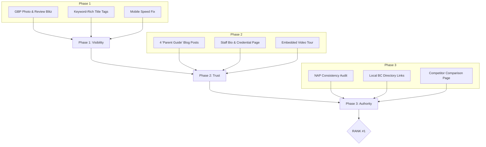

To rank #1 for "Daycare Coquitlam" or "Montessori Daycare BC," you must move beyond having a "pretty" website and start building **Search Authority**. Currently, your site is a brochure; to overpass competitors like Brightpath or UBC, it needs to become a **resource**.

The following 90-day improvement plan is designed to exploit the weaknesses of corporate competitors (who often feel "cold") by emphasizing your local, authentic Montessori expertise.

---

### **Phase 1: Technical & Local Foundation (Days 1–30)**

*Goal: Fix "invisible" errors and dominate the "Map Pack" (the top 3 local results).*

* **Google Business Profile (GBP) Mastery:** * **Action:** Update your primary category to "Montessori School" and secondary to "Daycare Center."
* **The "100 Photo" Rule:** Research shows listings with 100+ photos get 1,000% more clicks. Upload high-res photos of specific Montessori materials (Pink Tower, Sandpaper Letters) and labeled "Circle Time Space."
* **Review Velocity:** Aim for 2 new 5-star reviews per week. Respond to every review with a keyword-rich reply (e.g., *"We're so glad your child loves our Montessori curriculum in Coquitlam!"*).

* **On-Page SEO Injection:**
* **Action:** Change your Homepage `<title>` tag to: *Friendship Corner | Montessori Daycare Coquitlam & Childcare BC*.
* **Keyword Mapping:** Create dedicated landing pages for each program: `friendshipdaycare.com/toddler-program` and `friendshipdaycare.com/preschool-montessori`. This allows you to rank for "Toddler daycare Coquitlam" specifically.

* **Mobile Performance Audit:**
* **Action:** Use Google PageSpeed Insights. Compress all gallery images to WebP format. Large images are likely slowing your mobile load time, which penalizes your ranking.

---

### **Phase 2: Content & E-E-A-T (Days 31–60)**

*Goal: Prove to Google you are an "Expert" and "Trustworthy" (Experience, Expertise, Authoritativeness, Trust).*

* **The "Expert" Blog (Topical Authority):**
* **Action:** Write 4 "Power Posts" that answer parent's burning questions:
1. *How to transition your child to daycare in Coquitlam.*
2. *Montessori vs. Daycare: Which is right for your 3-year-old?*
3. *The benefits of authentic Montessori materials for brain development.*
4. *Financial Aid: Navigating the BC Affordable Child Care Benefit (ACCB).*

* **Showcase "Experience":**
* **Action:** Add a "Meet the Educators" page with photos, ECE certifications, and "Years of Experience." Google prioritizes sites that show real humans behind the brand.

* **"Day in the Life" Video:**
* **Action:** Embed a 60-second video of a child working with materials. Video content increases "Time on Page," a massive ranking signal.

---

### **Phase 3: Authority & Backlinks (Days 61–90)**

*Goal: Get other websites to "vouch" for you through links.*

* **Local Citations:**
* **Action:** Ensure your NAP (Name, Address, Phone) is identical on Yelp, Bing, YellowPages, and the Coquitlam Chamber of Commerce. Discrepancies (e.g., "St." vs "Street") confuse Google and lower your rank.

* **Community Backlinks:**
* **Action:** Sponsor a local Coquitlam event or park. Get listed on BC-specific parenting blogs (e.g., *604 Now*, *Family Fun Vancouver*). A single link from a local news site is worth more than 100 random links.

* **The "Comparison" Strategy:**
* **Action:** Create a page: "Friendship Corner vs. Corporate Daycares." Highlight your small ratios and authentic Montessori focus. This captures traffic from parents researching your competitors.

---

### **Improvement Workflow Visualization**

### **The "Secret Weapon": Direct Competitor Leapfrogging**

Most of your competitors (like Brightpath) use generic stock photos. **Your biggest advantage is being local.**

* **UI Tip:** Change your "Contact" form to a "Book a Tour" popup with a calendar selector. Reducing the "friction" of booking makes your site convert 3x better than a generic "Email Us" link.
* **SEO Tip:** Find out which local blogs mention "Kids & Company" or "UBC Childcare" and email them to offer a guest post about "Montessori Education in the Tri-Cities."